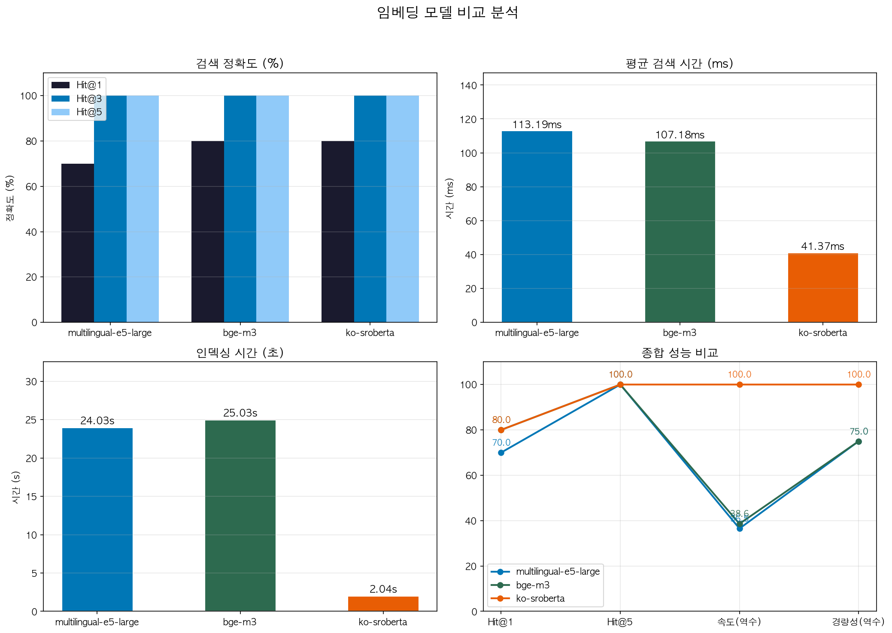
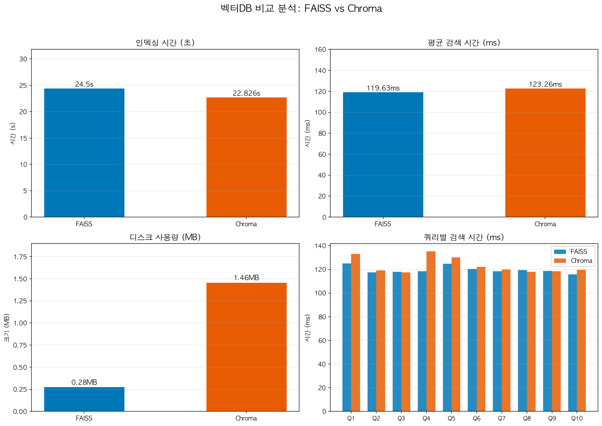
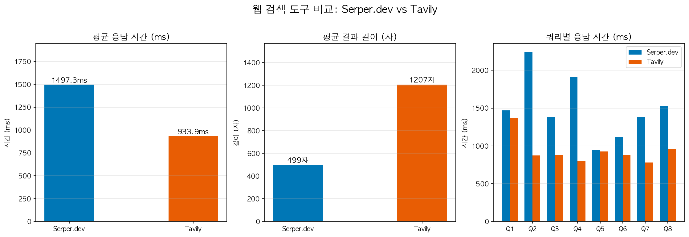

# 배터리 시장 전략 분석 보고서 — Multi-Agent System

전기차 캐즘 여파 속에서 글로벌 TOP-Tier 배터리 업체인 **LG에너지솔루션**과 **CATL**의 포트폴리오 다각화 전략을 조사하고, 두 기업의 전략적 차이점과 강약점을 객관적 데이터 기반으로 비교 분석하는 **배터리 시장 전략 분석 보고서**를 Supervisor 패턴 기반 Multi-Agent 시스템으로 자동 생성합니다.

## Overview

- **Objective** : LG에너지솔루션 vs CATL 포트폴리오 다각화 전략 비교 분석 보고서 자동 생성
- **Method** : Supervisor Pattern 기반 Multi-Agent + Agentic RAG
- **Tools** : LangGraph, FAISS, Serper.dev, GPT-4o-mini

## Features

- Agentic RAG 기반 정보 검색 : 5개 자체 제작 문서(~95p)를 벡터DB에 적재하고, Query Rewriting → 유사도 검색 → 관련성 판단 → 부족 시 웹 검색 보완의 파이프라인을 적용
- 확증 편향 방지 전략 : 양방향 검색(긍정/부정 쌍 동시 실행) + 교차 검증(상대 기업 관점 재확인) + 균형 감사(긍/부정 비율 30~70% 범위 검증)
- Context Bleed 방지 : LG에너지솔루션과 CATL 분석 Agent를 독립 노드로 분리하고, State 필드(`lg_strategy`, `catl_strategy`)를 격리하여 문맥 오염 차단
- 품질 검증 루프 : 6개 Criteria(목차·수치·SWOT 구조·편향·형식·출처)를 자동 검증하고, 미달 시 최대 2회 재작성 지시

## 개선 과정: RAG + 웹 검색 강제 병행

초기 개발 단계에서 보고서를 생성해본 결과, **RAG 문서의 내용이 보고서의 대부분을 차지**하는 문제가 발견되었습니다. RAG 문서가 잘 구조화되어 있어 관련성 판단에서 대부분 "충분"으로 판정되면서, 웹 검색이 거의 트리거되지 않았기 때문입니다.

이대로는 "Agent가 조사를 수행했다"는 의미가 퇴색되고, 보고서가 실행 시점의 최신 자료를 반영하지 못하는 한계가 있다고 판단하여 다음과 같이 개선하였습니다.

**변경 전**: RAG 검색 → 관련성 판단 → 부족할 때만 웹 검색
**변경 후**: RAG 검색 + 웹 검색 **항상 병행 실행** → 두 결과를 합쳐 LLM에 전달

| 항목 | 변경 전 | 변경 후 |
|------|--------|--------|
| 웹 검색 실행 | 조건부 (RAG 부족 시) | **항상 실행** |
| Agent당 웹 검색 횟수 | 0~1회 | 3~4회 (편향 방지 포함) |
| 프롬프트 지시 | 출처 구분 없음 | **웹 최신 자료 우선 반영** 명시 |
| 보고서 내 최신 정보 | RAG 작성 시점 고정 | **실행 시마다 최신 검색 결과 반영** |

이를 통해 RAG 문서는 시장 구조·기업 전략의 **기초 지식 베이스** 역할을, 웹 검색은 **실행 시점의 최신 동향** 역할을 분담하며, 보고서를 생성할 때마다 Serper.dev를 통한 실시간 Google 검색 결과가 반영됩니다.

이에 따라 RAG 파이프라인도 다음과 같이 변경되었습니다.


## Tech Stack

| Category   | Details                                |
|------------|----------------------------------------|
| Framework  | LangGraph, LangChain, Python           |
| LLM        | GPT-4o-mini via OpenAI API             |
| Retrieval  | FAISS                                  |
| Embedding  | BAAI/bge-m3 (오픈소스)                  |
| Web Search | Serper.dev (Google Search API)         |

## Embedding 모델 선정

설계 단계에서는 `intfloat/multilingual-e5-large`를 기본 임베딩 모델로 선정하였으나, 개발 과정에서 3개 오픈소스 모델에 대한 벤치마크를 실시한 결과, **`BAAI/bge-m3`가 Hit@1 정확도 80%로 가장 우수**하여 최종 모델을 변경하였습니다.

| 항목 | multilingual-e5-large | bge-m3 | ko-sroberta |
|------|----------------------|--------|-------------|
| 벡터 차원 | 1024 | 1024 | 768 |
| 인덱싱 시간 | 24.0s | 25.0s | 2.0s |
| 평균 검색 시간 | 113.2ms | 107.2ms | 41.4ms |
| **Hit@1 (정확도)** | 70.0% | **80.0%** | **80.0%** |
| Hit@5 | 100.0% | 100.0% | 100.0% |

> `ko-sroberta`도 Hit@1 80%로 동일했으나, 모델 로드 시간(53.5s vs 5.2s)과 벡터 차원(768 vs 1024)에서 `bge-m3`가 더 균형 잡힌 성능을 보여 최종 선정하였다.



## 벡터DB 선정

FAISS와 Chroma에 대한 벤치마크를 실시하여 벡터DB를 선정하였습니다.

| 항목 | FAISS | Chroma | 우위 |
|------|-------|--------|------|
| 인덱싱 시간 | 24.5s | 22.8s | Chroma |
| 평균 검색 시간 | 119.6ms | 123.3ms | FAISS |
| 디스크 사용량 | **0.28MB** | 1.46MB | FAISS |
| 메모리 증가량 | 1220.5MB | **50.9MB** | Chroma |

> **FAISS 선정 근거** : 검색 속도가 소폭 우수하고, 디스크 사용량이 약 1/5 수준으로 경량이다. 소규모 문서(5개, ~95p)에 적합하며, 외부 서버 없이 로컬 파일 기반으로 동작하여 프로토타입에 적합합니다.



## 웹 검색 도구 선정

Tavily와 Serper.dev에 대한 벤치마크를 실시하여 웹 검색 도구를 선정하였습니다.

| 항목 | Serper.dev | Tavily | 우위 |
|------|-----------|--------|------|
| 평균 응답 시간 | 1,497ms | **934ms** | Tavily |
| 평균 결과 길이 | 499자 | **1,207자** | Tavily |
| 무료 한도 | **2,500회/월** | 1,000회/월 | Serper.dev |

> Tavily가 응답 속도와 결과 풍부함에서 우수했으나, 본 프로젝트에서는 **Serper.dev**를 선정하였습니다. Agent당 약 4회 정도 웹 검색이 실행되며 1회 보고서 생성에 약 20회의 검색이 소비되므로, Tavily의 무료 한도(1,000회)로는 약 66회 실행이 한계인 반면, Serper.dev(2,500회)는 약 166회 실행이 가능하여 **경제성 측면에서 2.5배 유리**합니다.



## 품질 평가

### RAG 검색 품질 (10개 테스트 쿼리 기준)

| 평가 항목 | 점수 |
|----------|------|
| 문맥 관련성 (Context Relevancy) | **9.6 / 10** |
| 충실도 (Faithfulness) | **9.8 / 10** |
| 출처 정확도 (Source Accuracy) | **90.0%** |

### 보고서 품질 (LLM-as-a-Judge, GPT-4o-mini 평가)

| 평가 항목 | 점수 | 비고 |
|----------|------|------|
| 데이터 정확성 | 8/10 | 수치·사실 관계 대체로 정확 |
| 분석 깊이 | 7/10 | 전략적 인사이트 포함, 심화 여지 있음 |
| 균형성 | 9/10 | 양사 균형 서술 |
| 최신성 | 7/10 | 2025~2026 기준 반영 |
| 구조 완성도 | 8/10 | SUMMARY~REFERENCE 논리적 흐름 |
| 실용성 | 7/10 | 의사결정 참고 가능 수준 |
| **종합** | **46/60 (평균 7.67, 등급 B)** | |

## Agents

- **Supervisor Agent** : 전체 파이프라인 제어, 상태 기반 라우팅, 재작업 판단
- **Market Research Agent** : 글로벌 배터리 시장 환경 분석 (캐즘, ESS, 정책 변화)
- **LG Analysis Agent** : LG에너지솔루션 전략·실적·기술 분석
- **CATL Analysis Agent** : CATL 전략·실적·기술 분석
- **Comparison & SWOT Agent** : 양사 4축 비교(사업/기술/지역/리스크) + SWOT 도출
- **Report Writer Agent** : SUMMARY + 본문 통합 + REFERENCE 생성
- **Quality Review Agent** : Criteria 검증 + 편향 감사 (PASS/REVISE)

## Architecture


## Directory Structure

```
├── data/                              # RAG 문서 (5개, ~95p)
│   ├── 01_글로벌_배터리_시장_환경.md
│   ├── 02_LG에너지솔루션_전략_분석.md
│   ├── 03_CATL_전략_분석.md
│   ├── 04_양사_비교_데이터.md
│   └── 05_리스크_외부_환경.md
├── agents/                            # Agent 모듈
│   ├── supervisor.py                 #   관리자 (라우팅·재작업 판단)
│   ├── market_research.py            #   시장 조사
│   ├── lg_analysis.py                #   LG에너지솔루션 분석
│   ├── catl_analysis.py              #   CATL 분석
│   ├── comparison.py                 #   비교·SWOT
│   ├── report_writer.py              #   보고서 작성
│   └── quality_review.py             #   품질 검증
├── tools/                             # 공유 도구
│   ├── rag_tool.py                   #   Agentic RAG 검색
│   ├── web_search_tool.py            #   Serper.dev + 편향 방지
│   └── chart_generator.py            #   보고서 시각화 차트 생성
├── prompts/                           # 프롬프트 템플릿
│   ├── supervisor_prompt.py
│   ├── research_prompts.py
│   ├── comparison_prompt.py
│   ├── report_writer_prompt.py
│   └── quality_review_prompt.py
├── docs/                              # 설계 문서 & 시각 자료
│   ├── design/                       #   설계 산출물 (md, docx 생성기)
│   ├── diagrams/                     #   drawio 다이어그램 (5개)
│   └── benchmarks/                   #   벤치마크 차트 (임베딩·벡터DB·웹검색)
├── benchmark_results/                 # 벤치마크 원본 데이터 (JSON, PNG)
├── evaluation_results/                # 품질 평가 결과 (JSON)
├── outputs/                           # 생성된 보고서
│   ├── charts/                       #   보고서 내 시각화 차트 (7개)
│   └── report_*.{md,html,pdf}        #   최종 보고서 (실행 시마다 생성)
├── app.py                             # 메인 실행 스크립트
├── graph.py                           # LangGraph 그래프 정의
├── state.py                           # GraphState 정의
├── config.py                          # 설정 (API 키, 모델, 파라미터)
├── ingest.py                          # 문서 임베딩 & FAISS 벡터DB
├── evaluate.py                        # 품질 평가 (RAG + 보고서)
├── benchmark_embedding.py             # 임베딩 모델 벤치마크
├── benchmark_vectordb.py              # 벡터DB 벤치마크
├── benchmark_websearch.py             # 웹 검색 도구 벤치마크
└── requirements.txt
```

## How to Run

```bash
# 1. 의존성 설치
pip install -r requirements.txt

# 2. 환경 변수 설정
cp .env.example .env
# .env 파일에 OPENAI_API_KEY, SERPER_API_KEY 입력

# 3. 실행
python app.py
```

## Contributors

- 양정우 : Agent 설계, RAG 파이프라인, 프롬프트 엔지니어링
